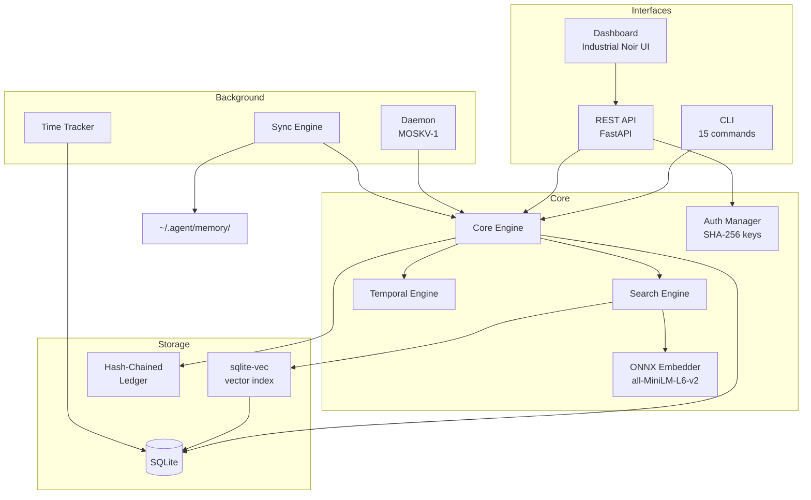
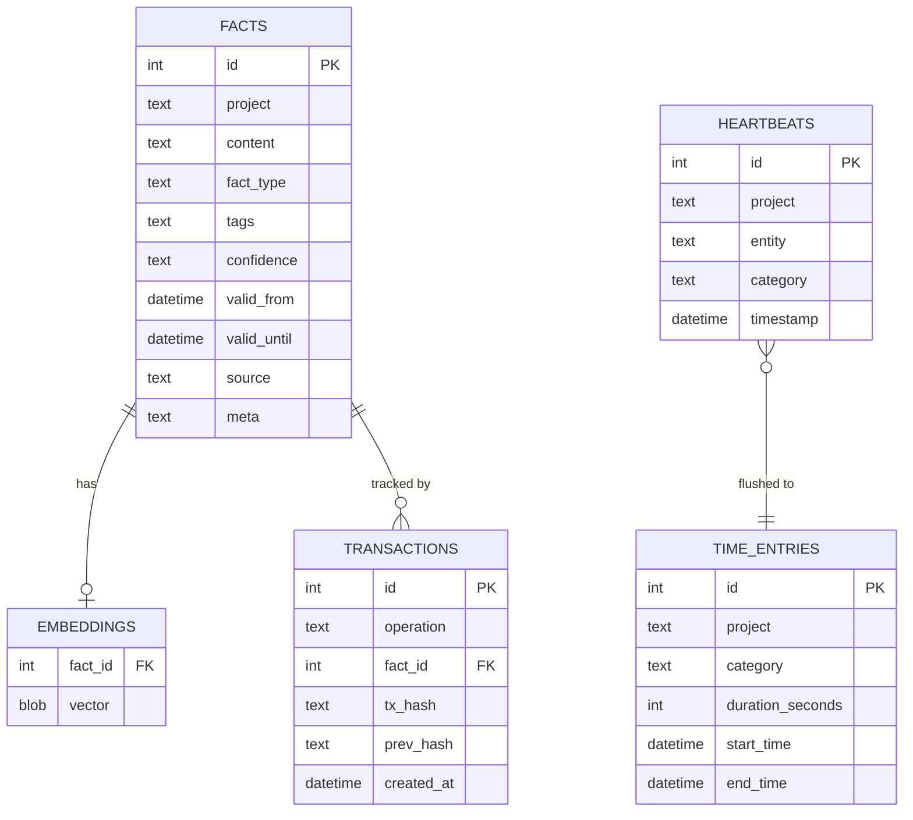

# Architecture

## Overview

CORTEX is a **local-first** memory system. Everything runs on your machine — no cloud services, no API keys to external providers.



## Core Concepts

### Facts

The fundamental unit of memory. A fact belongs to a **project** and has:

| Field | Description |
| --- | --- |
| `content` | The information (text) |
| `project` | Namespace (e.g., `my-api`) |
| `fact_type` | `knowledge`, `decision`, `error`, `config` |
| `tags` | JSON array of tags |
| `confidence` | `stated`, `inferred`, `observed` |
| `valid_from` | When the fact became true |
| `valid_until` | When the fact was deprecated (null = active) |

### Temporal Queries

Every fact has a temporal window (`valid_from` → `valid_until`). This enables:

- **Current view**: Only facts where `valid_until IS NULL`
- **Point-in-time**: Facts valid at a specific timestamp
- **History**: Full timeline including deprecated facts

### Hash-Chained Ledger

Every mutation (store, deprecate, edit) creates a **transaction** with a SHA-256 hash linked to the previous transaction. This creates a tamper-evident audit trail.

```text
TX #1: hash = SHA256(data_1)
TX #2: hash = SHA256(data_2 + hash_1)
TX #3: hash = SHA256(data_3 + hash_2)
...
```

### Embeddings


Text is embedded locally using `all-MiniLM-L6-v2` via ONNX Runtime (~5ms per embedding). Vectors are stored and indexed using `sqlite-vec` for fast cosine-similarity search.

## Data Model



## Sync Architecture

The sync engine maintains bidirectional consistency between JSON files in `~/.agent/memory/` and the CORTEX database:

1. **JSON → DB** (`cortex sync`): Reads JSON files, hashes with SHA-256 to detect changes, upserts into DB
2. **DB → JSON** (`cortex writeback`): Exports DB state back to JSON files

Change detection uses a persistent sync state file that tracks file hashes, so only modified files are processed.

## Daemon (MOSKV-1)

The background daemon monitors:

- **Site uptime** — HTTP health checks on configured URLs
- **Ghost state** — Detects stale or abandoned projects
- **Memory freshness** — Alerts when memory hasn't been synced recently
- **SSL certificates** — Warns before expiry
- **Disk usage** — Alerts when storage is running low
