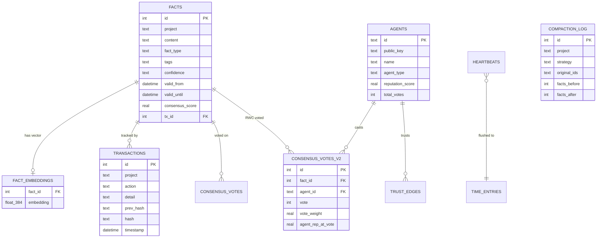

# CORTEX Architecture

> The Sovereign Ledger for AI Agents — v4.3.0 "THE SOUL"

## System Overview

CORTEX is a **local-first memory engine** that provides persistent, temporal, and cryptographically verifiable facts for AI agents. It combines a relational database with vector embeddings, hash-chained transactions, Merkle tree integrity, and multi-agent consensus — all running on SQLite without cloud dependencies.


---

## Core Concepts

### Facts — The Memory Primitive

Every piece of knowledge is a **Fact**. Facts are immutable records with temporal validity:

| Field | Type | Description |
|:---|:---|:---|
| `id` | INTEGER | Auto-incremented primary key |
| `project` | TEXT | Namespace (tenant isolation) |
| `content` | TEXT | The information itself |
| `fact_type` | TEXT | `knowledge`, `decision`, `error`, `ghost`, `config`, `bridge`, `axiom`, `rule` |
| `tags` | JSON | Searchable labels |
| `confidence` | TEXT | `stated`, `inferred`, `observed`, `verified`, `disputed` |
| `valid_from` | DATETIME | When the fact became true |
| `valid_until` | DATETIME | When deprecated (NULL = active) |
| `source` | TEXT | Origin agent or process |
| `meta` | JSON | Arbitrary metadata |
| `consensus_score` | REAL | Weighted agreement (default 1.0) |
| `tx_id` | INTEGER | Foreign key to the transaction that created it |

### Temporal Queries

Every fact has a temporal window (`valid_from` → `valid_until`):

- **Current view**: `WHERE valid_until IS NULL`
- **Point-in-time**: `WHERE valid_from <= ? AND (valid_until IS NULL OR valid_until > ?)`
- **Time travel**: Reconstruct database state at any transaction ID
- **History**: Full timeline including deprecated facts

### Hash-Chained Ledger

Every mutation creates a **transaction** with a SHA-256 hash linked to the previous one:

```
TX #1: hash = SHA256("GENESIS" + project + action + detail + timestamp)
TX #2: hash = SHA256(hash_1 + project + action + detail + timestamp)
TX #N: hash = SHA256(hash_{N-1} + ...)
```

This creates a **tamper-evident audit trail**. `verify_ledger()` walks the chain and reports any breaks.

### Merkle Tree Checkpoints

Periodically, the ledger creates Merkle tree checkpoints from batches of fact hashes: these enable O(log N) integrity verification and efficient synchronization between nodes.

### Multi-Agent Consensus

Facts can be **verified** or **disputed** by multiple agents. The consensus system:

1. Tracks reputation scores per agent (0.0–1.0)
2. Weighs votes by agent reputation
3. Updates `consensus_score` on each fact
4. Auto-registers any authenticated agent during voting
5. Stores votes in an immutable vote ledger

---

## Module Reference

### Engine Layer

| Module | Path | Purpose |
|:---|:---|:---|
| `engine/__init__.py` | `CortexEngine` | Composite orchestrator (sync + async). Entry point for all operations. |
| `engine_async.py` | `AsyncCortexEngine` | Native async engine for the REST API. Connection-pooled. |
| `engine/store_mixin.py` | `StoreMixin` | `store()`, `store_many()`, `deprecate()`, `update()` |
| `engine/query_mixin.py` | `QueryMixin` | `search()`, `recall()`, `history()` |
| `engine/consensus_mixin.py` | `ConsensusMixin` | `vote()`, `get_votes()` |
| `engine/sync_compat.py` | `SyncCompatMixin` | Synchronous fallbacks for CLI usage |
| `engine/ledger.py` | `ImmutableLedger` | Hash chain + Merkle tree management |
| `engine/snapshots.py` | `SnapshotManager` | Database snapshot creation and restoration |
| `engine/models.py` | `Fact`, `row_to_fact` | Data model and row mapping |

### API Layer

| Module | Path | Purpose |
|:---|:---|:---|
| `api.py` | `app` | FastAPI application with CORS, rate limiting, metrics |
| `api_deps.py` | Dependency injection | Provides `AsyncCortexEngine` to route handlers |
| `api_state.py` | Global state | Singleton references to engine and auth manager |
| `routes/facts.py` | CRUD + Voting | Store, recall, deprecate, vote on facts |
| `routes/search.py` | Search endpoints | GET/POST semantic search with project filtering |
| `routes/admin.py` | Key management | Bootstrap and manage API keys |
| `routes/stripe.py` | Billing | Stripe webhook handler for SaaS subscriptions |
| `models.py` | Pydantic models | Request/response schemas with validation |
| `auth.py` | `AuthManager` | HMAC-SHA256 API key authentication + RBAC |
| `i18n.py` | `get_trans()` | Translations (en/es/eu) for error messages |

### Search & Embeddings

| Module | Path | Purpose |
|:---|:---|:---|
| `embeddings/__init__.py` | `LocalEmbedder` | ONNX-optimized `all-MiniLM-L6-v2` (384-dim) |
| `embeddings/api_embedder.py` | `APIEmbedder` | Cloud embeddings via Gemini/OpenAI APIs |
| `embeddings/manager.py` | `EmbeddingManager` | Mode-aware switcher (`local` / `api`) |
| `search/` | Search package | Advanced semantic search with graph context |
| `search_sync.py` | Sync search | Synchronous search fallback for CLI |

### Memory Intelligence

| Module | Path | Purpose |
|:---|:---|:---|
| `compactor.py` | Auto-Compaction | Dedup (SHA-256 + Levenshtein), error merge, staleness prune |
| `compaction/` | Compaction package | Advanced compaction strategies |
| `compression.py` | Storage optimization | Fact compression for snapshots |
| `pruner.py` | Embedding pruner | Removes orphaned embeddings |
| `graph/` | Knowledge Graph | Entity-relation extraction, path finding, subgraph context |

### Infrastructure

| Module | Path | Purpose |
|:---|:---|:---|
| `config.py` | Configuration | Centralized env-var loading with `reload()` |
| `schema.py` | Database schema | All `CREATE TABLE` statements + `ALL_SCHEMA` list |
| `migrations/` | Schema migrations | Versioned database migrations |
| `canonical.py` | Canonical JSON | Deterministic JSON serialization for hashing |
| `temporal.py` | Time utilities | ISO 8601 helpers, timezone-aware timestamps |
| `metrics.py` | Observability | Prometheus-compatible metrics collection |
| `crypto.py` | Cryptography | AES-256-GCM vault for secrets |
| `cache.py` | LRU Cache | Thread-safe caching layer |
| `exceptions.py` | Custom errors | `FactNotFound`, `LedgerCorrupted`, etc. |

### Background Services

| Module | Path | Purpose |
|:---|:---|:---|
| `daemon/` | MOSKV-1 Daemon | Site monitoring, ghost detection, cert checks, disk alerts |
| `sync/` | Sync Engine | Bidirectional JSON ↔ DB synchronization |
| `timing/` | Time Tracker | Heartbeat-based developer time tracking |
| `chronos.py` | Chronos | Advanced temporal analysis |

### External Integrations

| Module | Path | Purpose |
|:---|:---|:---|
| `mcp/` | MCP Server | Model Context Protocol for Claude/Cursor |
| `langbase/` | Langbase | LLM pipe integration |
| `llm/` | LLM providers | Multi-provider LLM support |
| `sovereign_gate.py` | Sovereign Gate | HMAC-authenticated internal gateway |
| `gate/` | Gate package | Rate limiting, validation, request filtering |
| `federation.py` | Federation | Multi-node shard distribution |
| `storage/` | Storage backends | Local SQLite + Turso cloud backend |

---

## Data Flow

### Store a Fact


### Semantic Search


---

## Security Model

| Layer | Mechanism |
|:---|:---|
| **Authentication** | HMAC-SHA256 API keys with prefix-based lookup |
| **Authorization** | RBAC with `read`, `write`, `admin` permissions |
| **Tenant Isolation** | All queries scoped by `tenant_id` from auth token |
| **Data Integrity** | SHA-256 hash-chained transaction ledger |
| **Secrets** | AES-256-GCM encrypted vault (`crypto.py`) |
| **Rate Limiting** | Sliding window with bounded eviction (per IP) |
| **Input Validation** | Pydantic models with `max_length` constraints |
| **CORS** | Explicit origin allowlist (no wildcards) |

---

## Configuration

All settings are loaded from environment variables via `cortex/config.py`. Call `config.reload()` to refresh at runtime (essential for test isolation).

| Variable | Default | Description |
|:---|:---|:---|
| `CORTEX_DB` | `~/.cortex/cortex.db` | Database path |
| `CORTEX_ALLOWED_ORIGINS` | `localhost:3000,5173` | CORS origins |
| `CORTEX_RATE_LIMIT` | `300` | Requests per window |
| `CORTEX_RATE_WINDOW` | `60` | Window in seconds |
| `CORTEX_EMBEDDINGS` | `local` | `local` or `api` |
| `CORTEX_EMBEDDINGS_PROVIDER` | `gemini` | API provider |
| `CORTEX_STORAGE` | `local` | `local` or `turso` |
| `CORTEX_GRAPH_BACKEND` | `sqlite` | `sqlite` or `neo4j` |
| `CORTEX_POOL_SIZE` | `5` | Connection pool size |

See `.env.example` for the complete list.

---

## Testing

```bash
# All tests (676 tests, 60s timeout)
make test

# Fast tests only (no torch imports)
make test-fast

# Slow tests (graph RAG, embeddings)
make test-slow
```

**Isolation**: Tests use `config.reload()` + autouse fixtures in `tests/conftest.py` to ensure zero state leakage between tests.

---

## Database Schema (ERD)



---

## Deployment

### Development
```bash
pip install -e ".[dev]"
uvicorn cortex.api:app --reload --port 8484
```

### Production (Docker)
```bash
docker compose -f docker-compose.prod.yml up -d
```

Uses Caddy as TLS reverse proxy with security headers (HSTS, X-Frame-Options, CSP).
